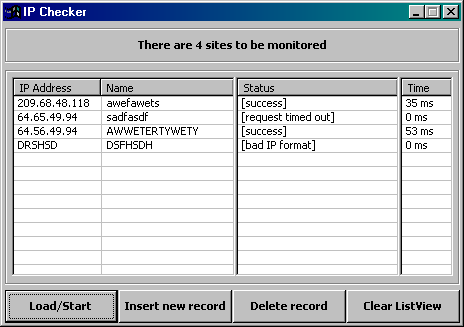



## IP status checker, loop through a database of IP's

### Description

This program loops through an Access database of IP addresses and pings every one continuously. You can add, delete your own IP addresses. You can customize a status event to trigger when a time tolerance is reached. Then you can be notified of a problem. I wrote something like this years ago for our network department to alphanumerically page the on call if an IP timed out. We had servers, routers, and switches in the list. I chopped this code together from code I found here and on www.vbaccelerator.com. I have one small thing I would like to fix, that is how to add all listview’s into just 1 listwiew. If you can show me how I will fix and re-upload the code.
 
### More Info
 

             |
---                |---
**Submitted On**   |2002-07-10 17:41:26
**By**             |[Chad Gutowsky](https://github.com/Planet-Source-Code/PSCIndex/blob/master/ByAuthor/chad-gutowsky.md)
**Level**          |Advanced
**User Rating**    |4.5 (27 globes from 6 users)
**Compatibility**  |VB 6\.0
**Category**       |[Miscellaneous](https://github.com/Planet-Source-Code/PSCIndex/blob/master/ByCategory/miscellaneous__1-1.md)
**World**          |[Visual Basic](https://github.com/Planet-Source-Code/PSCIndex/blob/master/ByWorld/visual-basic.md)
**Archive File**   |[IP\_status\_1046557102002\.zip](https://github.com/Planet-Source-Code/chad-gutowsky-ip-status-checker-loop-through-a-database-of-ip-s__1-36787/archive/master.zip)

